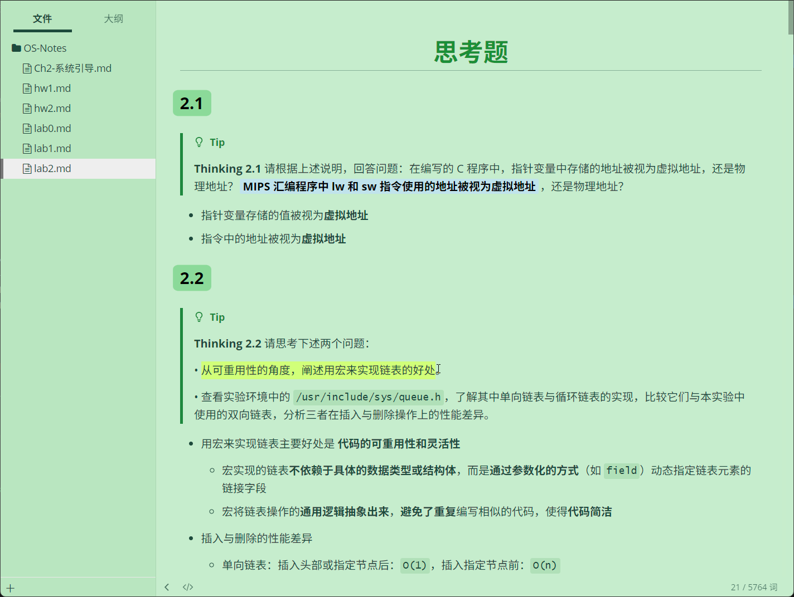
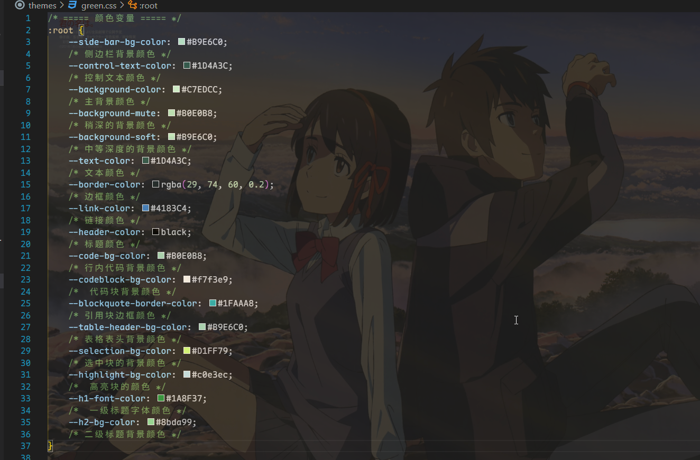

# WhisperEden
A peaceful and calm Typora green theme ~  

# Overview

# Introduction
WhisperEden 是一个融合了宁静与自然之美的主题，仿佛将你带入一片轻声细语的伊甸园。背景色 #C7EDCC 和 #B9E6C0 的柔和浅绿色，如同初春的嫩叶，清新而温暖，营造出一种平和与舒适的氛围。在这里，你可以远离喧嚣，沉浸在自然的美好中，感受每一刻的宁静与灵感。无论是创作、阅读，还是简单地放松身心，WhisperEden 都为你提供了一个完美的避风港

# Diy
* 在 WhisperEden 的设计中，我们赋予用户高度可定制性和 DIY 的能力，让每个人都能根据自己的喜好打造独一无二的界面体验。通过定义一套完整的 CSS 变量（如上所示），用户可以轻松调整每一个细节，从背景颜色到文本颜色，从边框到高亮效果，一切都触手可及，直接修改颜色变量的值即可  
* 这种高度可定制的设计理念，不仅让 WhisperEden 成为一个功能强大的工具，更让它成为用户表达个性的画布。无论你是追求极简主义，还是偏爱丰富的色彩，只需调整这些变量，就能轻松实现你的理想界面。WhisperEden，让每一次使用都成为一次独特的创作之旅  

