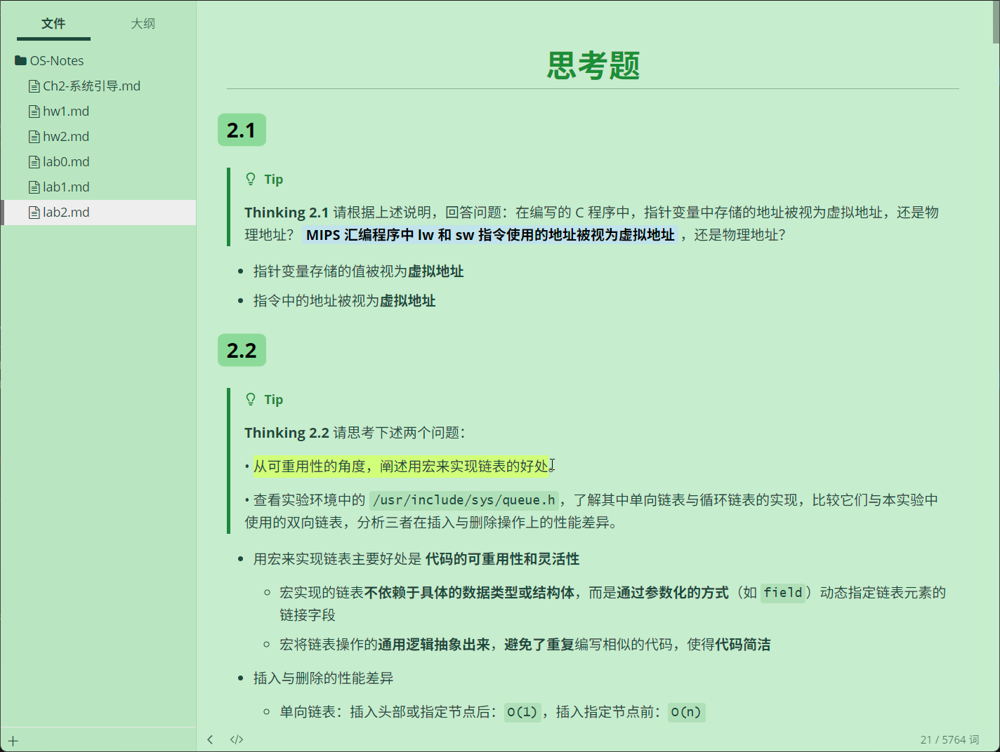

# WhisperEden
A peaceful and calm Typora green theme ~

# Overview

# Introduction
WhisperEden is a theme that blends tranquility and the beauty of nature, as if transporting you to a whispering Eden. The soft light green background colors #C7EDCC and #B9E6C0 resemble the tender leaves of early spring, fresh and warm, creating a peaceful and comfortable atmosphere. Here, you can escape the noise, immerse yourself in the beauty of nature, and experience moments of calm and inspiration. Whether you're creating, reading, or simply relaxing, WhisperEden provides the perfect sanctuary.  

# DIY
* In the design of WhisperEden, we empower users with high customizability and DIY capabilities, allowing everyone to create a unique interface experience tailored to their preferences. By defining a complete set of CSS variables (as shown below), users can easily adjust every detail, from background colors to text colors, from borders to highlight effects—everything is within reach. Simply modify the values of the color variables to achieve your desired look.
* This highly customizable design philosophy not only makes WhisperEden a powerful tool but also a canvas for users to express their individuality. Whether you prefer minimalism or vibrant colors, adjusting these variables allows you to effortlessly realize your ideal interface. WhisperEden turns every use into a unique creative journey.  

